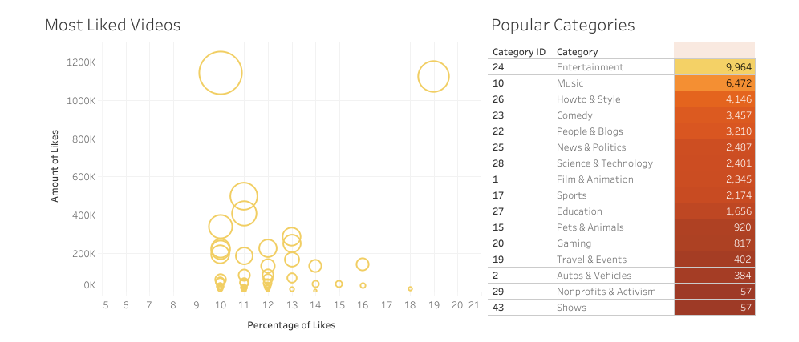
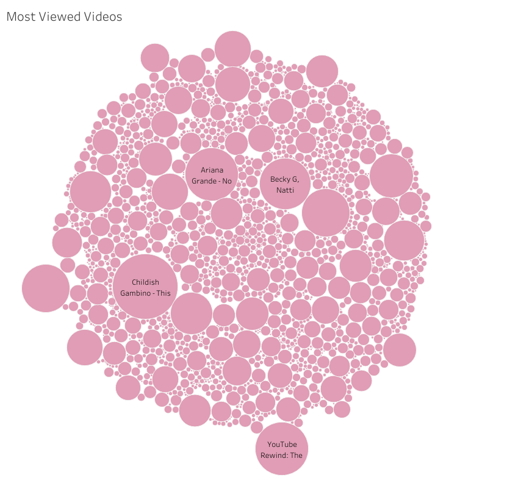

# AntiNova928 Data Science Portfolio

## [Project 1 - Simple SQL Query Project Overview:](https://github.com/AntiNova928/PortfolioProjects.git)
### Created a simple SQL query based on YouTube trending videos from 2017-2018
* Wanted to know if there are any correlation between the trending videos and the type of content being put out
* Created a simple data exploration tool in SQL to explore on how to break down the data and gain insightful knowledge
* Optimized the dataset by creating CTE and CREATE TABLE to ensure that there are no repeated data

## [Project 2 - Data Visualization on Tableau:](https://public.tableau.com/app/profile/daniel.ng2681/viz/TrendingYoutubeVideos2017-2018/Dashboard1)
### A continuation of Project 1, whereby the data was cleaned and then presented as a data visualization project made in Tableau
* To create an optimum data visualization of most viewed videos, most liked videos and most disliked videos
* To find out what are some of the trending category on YouTube in the year 2017-2018

## [Project 3 - Simple SQL Data Cleaning Project Overview:](https://github.com/AntiNova928/PortfolioProjects)
### Created a simple SQL data cleaning project on housing in Nashville
* Trying out different SQL queries to clean the existing dataset
* Some queries include helping to standardize the date format, removing duplicates and even updating new columns 
* To optimize and make the dataset more user-friendly for other data analyst to analyze the data 
